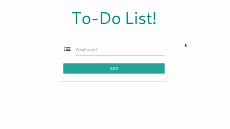

# PIAIC-React-Assignment
React. js is an open-source JavaScript library that is used for building user interfaces specifically for single-page applications. It's used for handling the view layer for web and mobile apps. React also allows us to create reusable UI components.


### Assignments

#### 1. TODO APP

<br />

#### 2. Ecommerce App 
Develop Ecommerce-App using React Hooks<br />
[Project Description](Ecommerce-App/README.md)

---------------------------------

## Starter-kit

1. [React-Template](react-template)
2. [React-Hooks-with-Boostrap-Kit](React-Hooks-with-Boostrap-Kit)
3. [JSON-Server](https://github.com/Ameen-Alam/JSON-Server)
4. [React-Router-DOM](react-router-dom)
5. [React-Redux-Template](react-redux-template)
6. [React-Redux-TypeScript-Template](react-redux-typescript-template)
7. [React-Redux-App](react-redux-app)
8. [React-ContextAPI-Hooks](react-context-api-hooks)
9. [React-Material-UI-Contentful](react-material-ui-contentful)


---------------------------------

### Start Project
```$ npm install```  -  React install dependencies from package.json<br />
```$ npm start```    -  react-scripts start<br />
```$ npm build```    -  react-scripts build<br />
```$ npm test```     -  react-scripts test<br />
```$ npm eject```    -  react-scripts eject<br />

---------------------------------

### Create a New React App
Install NodeJS LTS Version<br />
Node.js is a JavaScript runtime built on Chrome's V8 JavaScript engine<br />
[Download Node.js](https://nodejs.org/en/)<br /> <br />
```$ npx create-react-app my-app```<br />
```$ cd my-app```<br />
```$ npm start```<br />


##### [Complete React Tutorial for Beginners (2020)](https://daveceddia.com/react-tutorial/?fbclid=IwAR0NzHXjI38xaf5mhC5ds1_EOPl5CVoquEQ7mXU0fSmS6BxsF3eix8i1OFc)

##### [CodeSandbox is an online code editor and prototyping tool that makes creating and sharing web apps faster.](https://codesandbox.io/s/new)

---------------------------------

### React Documentation
1. [Getting Started](https://reactjs.org/docs)
2. [React Component](https://reactjs.org/docs/react-component.html)
2. [Components and Props](https://reactjs.org/docs/components-and-props.html)
2. [State and Lifecycle](https://reactjs.org/docs/state-and-lifecycle.html)
2. [Hooks API Reference](https://reactjs.org/docs/hooks-reference.html)
2. [React Lifecycle Methods Diagram](http://projects.wojtekmaj.pl/react-lifecycle-methods-diagram/)
2. [State Management with React Hooks and Context API in 10 lines of code!](https://medium.com/simply/state-management-with-react-hooks-and-context-api-at-10-lines-of-code-baf6be8302c)
2. [RxJS with React Hooks for state management](https://blog.logrocket.com/rxjs-with-react-hooks-for-state-management/)


### 11 React Boilerplates and Starter Kits for 2019
[Boilerplates](https://blog.bitsrc.io/11-react-application-boilerplates-for-2019-b49a8226ea54)


### React libraries

1. [Create React App](https://reactjs.org/docs/create-a-new-react-app.html)
Create React App is a command line interface created by Facebook developers that enables you to easily create a React.js project. It builds structures of catalogs and files, includes tools needed at the start and helps you build, test and launch your application.

2. [React Router](https://reacttraining.com/react-router/web/guides/quick-start)
React Router, a group of navigational components, synchronizes the components of the UI with browsers address. This makes it effortless to handle navigation in SPA.

3. [Material UI](https://material-ui.com/)
Material-UI is an open-source project that features React components that implement Google's Material Design. 

4. [Styled Components](https://styled-components.com/)
Styled Components are one of the new ways to use CSS in modern JavaScript. It is the meant to be a successor of CSS Modules, a way to write CSS that's scoped to a single component, and not leak to any other element in the page.

5. [Redux](https://redux.js.org/)
Redux is a predictable state container for JavaScript applications. It helps you write applications that behave consistently, run in different environments (client, server, and native), and are easy to test. Simply put, Redux is a state management tool.

6. [Redux-observable](https://redux-observable.js.org/)
Redux-observable is a tool for handling async logic with React and Redux. This is important because React doesn't generally support async functions. Redux-observable is an interesting alternative to redux-saga and redux-thunk, particularly if you're already experienced with RxJS.

7. [Redux Thunk](https://github.com/reduxjs/redux-thunk)
Redux Thunk is a middleware that lets you call action creators that return a function instead of an action object. That function receives the store's dispatch method, which is then used to dispatch regular synchronous actions inside the body of the function once the asynchronous operations have completed.

8. [RxJS](https://rxjs-dev.firebaseapp.com/)
RxJS (Reactive Extensions for JavaScript) is a library for reactive programming using observables that makes it easier to compose asynchronous or callback-based code. ... RxJS provides an implementation of the Observable type, which is needed until the type becomes part of the language and until browsers support it.

9. [React bootstrap](https://react-bootstrap.github.io/)
React-Bootstrap replaces the Bootstrap JavaScript. Each component has been built from scratch as a true React component, without unneeded dependencies like jQuery. As one of the oldest React libraries, React-Bootstrap has evolved and grown alongside React, making it an excellent choice as your UI foundation.

10. [React Spinner](https://www.npmjs.com/package/react-spinners)


11. [Semantic UI](https://react.semantic-ui.com/)
Semantic UI is a UI component framework for theming websites. Semantic UI enables developers to build websites with fast and concise HTML, along with a complete mobile responsive experience. Semantic UI treats words and classes as exchangeable concepts.

12. [OnsenUI](https://onsen.io/)
All animations in Onsen UI have been tuned and optimized to perform well on a wide range of devices. We take great care to ensure that apps made using Onsen UI feel smooth even on lower end devices.

13. [React DnD](https://react-dnd.github.io/react-dnd/about)
React DnD is a set of React utilities to help you build complex drag and drop interfaces while keeping your components decoupled.

14. [React Virtualized](https://github.com/bvaughn/react-virtualized)

15. [React Desktop](https://reactdesktop.js.org/)

16. [Redux-Saga](https://redux-saga.js.org/)
Redux-saga is a library that aims to make side effects easier and better by working with sagas. ... In the context of Redux, a saga is implemented as a middleware (we can't use a reducer because this must be a pure function) to coordinate and trigger asynchronous actions (side-effects).

17. [Redux Actions](https://redux-actions.js.org/)

18. [AXIOS](https://github.com/axios/axios)
Axios is a Promise-based HTTP client for JavaScript which can be used in your front-end application and in your Node. js backend. By using Axios it's easy to send asynchronous HTTP request to REST endpoints and perform CRUD operations.

---------------------------------

##### Form Link
https://forms.gle/9KNCjcbtLR3f5ymX7